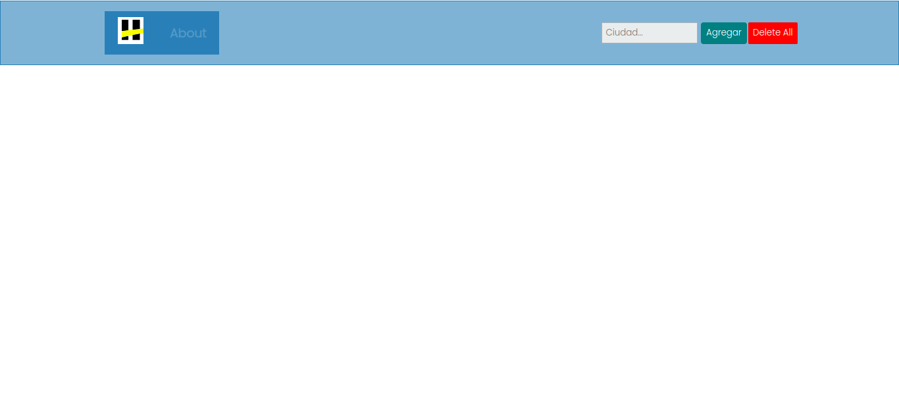
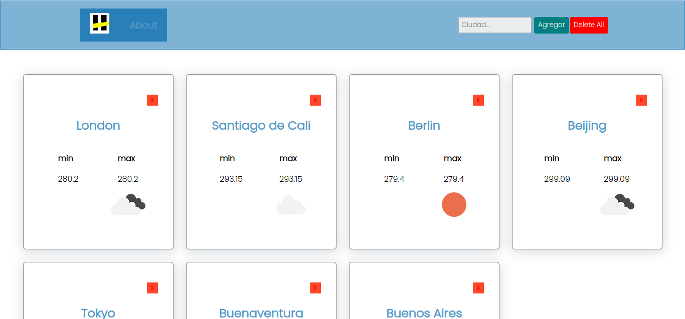
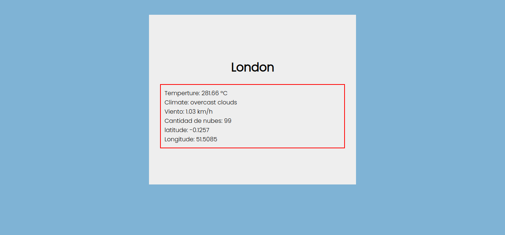
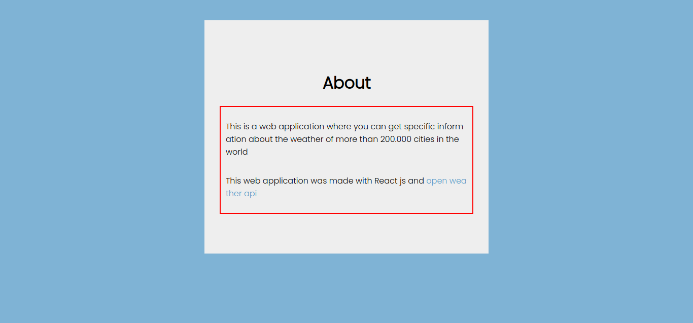

# weather App

_This is a web application where you can get specific information about the weather of more than 200.000 cities in the world_

Home

Home filled with cards

City details
About



### Instalation 🔧

_To use this projct you just need to run on your pc_

```
npm install
```

_then this_

```
npm start
```

## built it with 🛠️

_This project was created with_

* [React js](https://es.reactjs.org/docs/getting-started.html) - El framework web usado
* [open weather api](https://openweathermap.org/api) - Manejador de dependencias
---
⌨️ con ❤️ por [Larryc8](https://github.com/Villanuevand) 😊
